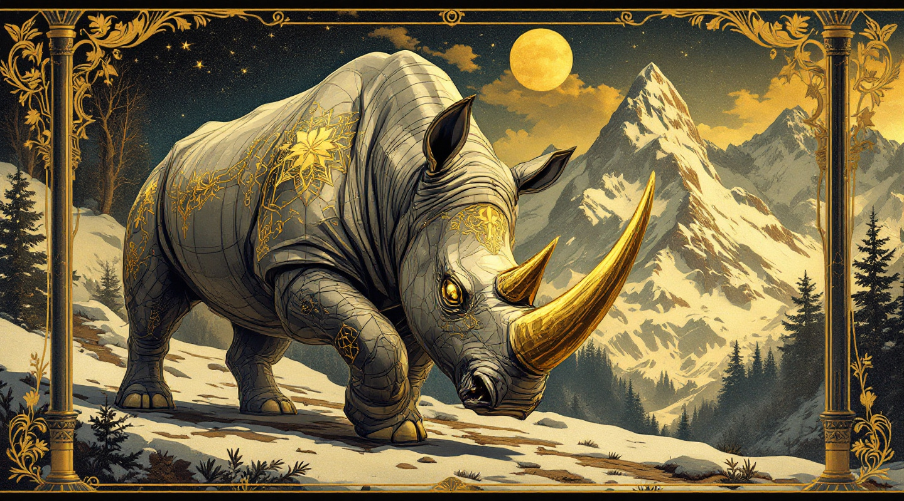
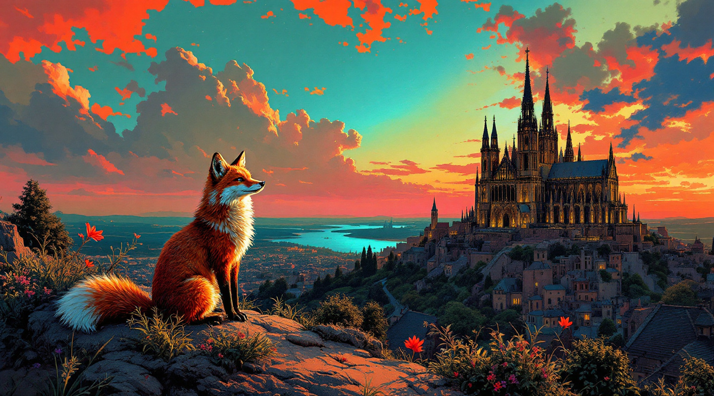

# Test Runs with Contextual Values (Entered Values in Textbox)

## Test Run 1:

- Objekt: Nashorn mit Gold
- Aktion: Fligen
- Emotion: Wütend
- Szene: Alpen
- Stil: Art Nouveau
- AR: 16:9

Payload:
```json
{
  "fixed": [],
  "contextual": [
    {
      "template": "the image must contain object",
      "subject": "Nashorn mit Gold"
    },
    {
      "template": "the object of the image must be engaged in action",
      "subject": "fliegen"
    },
    {
      "template": "the object of the image must display emotion",
      "subject": "Wütend"
    },
    {
      "template": "the image must be depicted in scene",
      "subject": "Alpen"
    },
    {
      "template": "the image must be generated in style",
      "subject": "Art Nouveau"
    }
  ],
  "aspectRatio": "16:9",
  "turbo": true
}
```

### MeinFoto.ai prompt (`93b6fcde-e26d-4345-940d-3fecc98e5f3f`)
> the image must contain object rhinoceros with gold, 
> the object of the image must be engaged in action fly, 
> the object of the image must display emotion Angry, 
> the image must be depicted in scene Alps, 
> the image must be generated in style Art Nouveau

### Result



## Test Run 2:

- Objekt: Silberner Wolf
- Aktion: Heulen
- Emotion: Erhaben
- Szene: Schwarzwald
- Stil: Jugendstil
- AR: 16:9

Payload:
```json
{
  "fixed": [],
  "contextual": [
    {
      "template": "the image must contain object",
      "subject": "Silberner Wolf"
    },
    {
      "template": "the object of the image must be engaged in action",
      "subject": "Heulen"
    },
    {
      "template": "the object of the image must display emotion",
      "subject": "Erhaben"
    },
    {
      "template": "the image must be depicted in scene",
      "subject": "Schwarzwald"
    },
    {
      "template": "the image must be generated in style",
      "subject": "Jugendstil"
    }
  ],
  "aspectRatio": "16:9",
  "turbo": true
}
```

### MeinFoto.ai prompt (`419e11b9-2012-453d-9156-bf14bc7ac203`)
> the image must contain object Silver Wolf, 
> the object of the image must be engaged in action howling, 
> the object of the image must display emotion sublime, 
> the image must be depicted in scene Black Forest, 
> the image must be generated in style Art Nouveau
---
### Result


## Test Run 3:

- Objekt: Feuer Fuchs
- Aktion: Beobachten
- Emotion: Mystisch
- Szene: Gotischer Dom
- Stil: Popart
- AR: 16:9

Payload:
```json
{
  "fixed": [],
  "contextual": [
    {
      "template": "the image must contain object",
      "subject": "Feuer Fuchs"
    },
    {
      "template": "the object of the image must be engaged in action",
      "subject": "Beobachten"
    },
    {
      "template": "the object of the image must display emotion",
      "subject": "Mystisch"
    },
    {
      "template": "the image must be depicted in scene",
      "subject": "Gotischer Dom"
    },
    {
      "template": "the image must be generated in style",
      "subject": "Popart"
    }
  ],
  "aspectRatio": "16:9",
  "turbo": true
}
```

### MeinFoto.ai prompt (`c47a4f25-ab0c-45ec-9418-39aec6eb6765`)
> the image must contain object Fire Fox, 
> the object of the image must be engaged in action Observe, 
> the object of the image must display emotion Mystical, 
> the image must be depicted in scene Gothic cathedral, 
> the image must be generated in style Pop art
---
### Result


## Test Run 4:

- Objekt: Bronze-Löwe
- Aktion: Brüllen
- Emotion: Majestätisch
- Szene: Sanddünen
- Stil: Jugendstil
- AR: 16:9

Payload:
```json
{
  "fixed": [],
  "contextual": [
    {
      "template": "the image must contain object",
      "subject": "Bronze-Löwe"
    },
    {
      "template": "the object of the image must be engaged in action",
      "subject": "Brüllen"
    },
    {
      "template": "the object of the image must display emotion",
      "subject": "Majestätisch"
    },
    {
      "template": "the image must be depicted in scene",
      "subject": "Sanddünen"
    },
    {
      "template": "the image must be generated in style",
      "subject": "Jugendstil"
    }
  ],
  "aspectRatio": "16:9",
  "turbo": true
}
```

### MeinFoto.ai prompt (`732f93c1-9673-4d53-a55a-9f6d28544aa7`)
> the image must contain object bronze lion, 
> the object of the image must be engaged in action Roar, 
> the object of the image must display emotion Majestic, 
> the image must be depicted in scene sand dunes, 
> the image must be generated in style Art Nouveau
---
### Result


## Test Run 5:

- Objekt: Goldener Terminator mit filigranen Gravuren
- Aktion: Eine mechanische Rose halten
- Emotion: Melancholisch
- Szene: Verfallene Cyberpunk-Ruinen
- Stil: Dieselpunk
- AR: 16:9

Payload:
```json
{
  "fixed": [],
  "contextual": [
    {
      "template": "the image must contain object",
      "subject": "Goldener Terminator mit filigranen Gravuren"
    },
    {
      "template": "the object of the image must be engaged in action",
      "subject": "Eine mechanische Rose halten"
    },
    {
      "template": "the object of the image must display emotion",
      "subject": "Melancholisch"
    },
    {
      "template": "the image must be depicted in scene",
      "subject": "Verfallene Cyberpunk-Ruinen"
    },
    {
      "template": "the image must be generated in style",
      "subject": "Dieselpunk"
    }
  ],
  "aspectRatio": "16:9",
  "turbo": true
}
```

### MeinFoto.ai prompt (`7fc24d4b-37b6-480e-a8c2-faa3adcb196a`)
> the image must contain object Golden Terminator with filigree engravings, 
> the object of the image must be engaged in action Holding a mechanical rose, 
> the object of the image must display emotion Melancholic, 
> the image must be depicted in scene Dilapidated cyberpunk ruins, 
> the image must be generated in style Dieselpunk
---
### Result


# Test Runs with Fixed Values (Selected Images From Sliders)

## Test Run 1:

Payload:
```json
{
  "fixed": [
    "animal cat selfie, glasses, realistic dynamic",
    "mma fighter in ring with mean face and costume in mexican lucha livre style in fight ring, double light",
    "surprised dog face after steeling a bone comic style color",
    "tokio in 2100 futuristic",
    "group of girls on japanese street, anime style, style raw"
  ],
  "contextual": [],
  "aspectRatio": "16:9",
  "turbo": true
}
```

### MeinFoto.ai prompt (`2b4448cd-27cc-46be-811d-1df97fc71e77`)

> animal cat selfie, glasses, realistic dynamic, 
> mma fighter in ring with mean face and costume in mexican lucha livre style in fight ring, double light, 
> surprised dog face after steeling a bone comic style color, 
> tokio in 2100 futuristic, 
> group of girls on japanese street, anime style, style raw

### Result


## Test Run 2

Payload:
```json
{
    "fixed": [
        "Luxury french palace, billionairs home, layered hyper realism",
        "flying elefant with dress action realistic",
        "extremly happy child after blowing birthday candles",
        "beautyful green landscape sheeps sunny day photo",
        "atompunk style art alternate universe computers are the system controllers"
    ],
    "contextual": [],
    "aspectRatio": "16:9",
    "turbo": true
}
```

### MeinFoto.ai prompt (`daa8d402-d232-41e0-8d45-244005f57ef5`)
> Luxury french palace, billionairs home, layered hyper realism, flying elefant with dress action realistic, 
> extremly happy child after blowing birthday candles, beautyful green landscape sheeps sunny day photo, 
> atompunk style art alternate universe computers are the system controllers

### Result
 


## Test Run 3

Payload:
```json
{
  "fixed": [
    "futuristic phantastic plain flying, outside view from 100 meters background clouds and sunset, hyper realistic",
    "mma fighter in ring with mean face and costume in mexican lucha livre style in fight ring, double light",
    "scene in which a character is caught in a fit of road rage during a heavy traffic jam, Describe their thoughts and actions as their anger escalates behind the wheel",
    "sao paulo rua paulista at the beach",
    "sdxl 1.0 astronaut flying over ice cream landscape"
  ],
  "contextual": [],
  "aspectRatio": "16:9",
  "turbo": true
}
```

### MeinFoto.ai prompt (`4f52a6c3-fc12-4510-b8fe-3032ae2ae80c`)
> futuristic phantastic plain flying, outside view from 100 meters background clouds and sunset, 
> hyper realistic, mma fighter in ring with mean face and costume in mexican lucha livre style in fight ring, 
> double light, scene in which a character is caught in a fit of road rage during a heavy traffic jam, 
> Describe their thoughts and actions as their anger escalates behind the wheel, 
> sao paulo rua paulista at the beach, sdxl 1.0 astronaut flying over ice cream landscape

### Result
 

## Test Run 4

Payload:
```json
{
  "fixed": [
    "pencil drawing of football player screeming, graffiti helmet, light, floral background, realistic portrait",
    "athletic cliffhanger on golden gate bridge, close up sunny day, style raw",
    "child very sad protrait aquarel",
    "muscle beach with nice girls and body builders",
    "sdxl 1.0 cashier at supermarket"
  ],
  "contextual": [],
  "aspectRatio": "16:9",
  "turbo": true
}
```

### MeinFoto.ai prompt (`32bab0b7-8ae0-4de9-8441-36080350e04e`)
> pencil drawing of football player screeming, graffiti helmet, light, floral background, 
> realistic portrait, athletic cliffhanger on golden gate bridge, close up sunny day, 
> style raw, child very sad protrait aquarel, muscle beach with nice girls and body builders, 
> sdxl 1.0 cashier at supermarket

### Result
```json
{
  "response": {
    "id":"32bab0b7-8ae0-4de9-8441-36080350e04e",
    "status":"Content Moderated",
    "result":null,
    "progress":null
  }
}
```

## Test Run 5

Payload:
```json
{
  "fixed": [
    "animal cat selfie, glasses, realistic dynamic",
    "boy break dancing, cap head phones street wear late 70s",
    "extremely angry old man with hat at train counter portrait",
    "sailing boat at beach with beautyful woman on front photo",
    "3d portrait of a person that is holding blue blobs, in the style of stefan gesell, dark white and orange, mixes realistic and fantastical elements, grotesque characters, jakub różalski, futuristic organic, carnivalesque"
  ],
  "contextual": [],
  "aspectRatio": "16:9",
  "turbo": true
}
```

### MeinFoto.ai prompt (`1bad01b8-df9a-41ce-bd06-505c4753a300`)
> animal cat selfie, glasses, realistic dynamic, boy break dancing, 
> cap head phones street wear late 70s, extremely angry old man with hat at train counter portrait, 
> sailing boat at beach with beautyful woman on front photo, 
> 3d portrait of a person that is holding blue blobs, in the style of stefan gesell, 
> dark white and orange, mixes realistic and fantastical elements, grotesque characters, jakub różalski, 
> futuristic organic, carnivalesque

### Result

